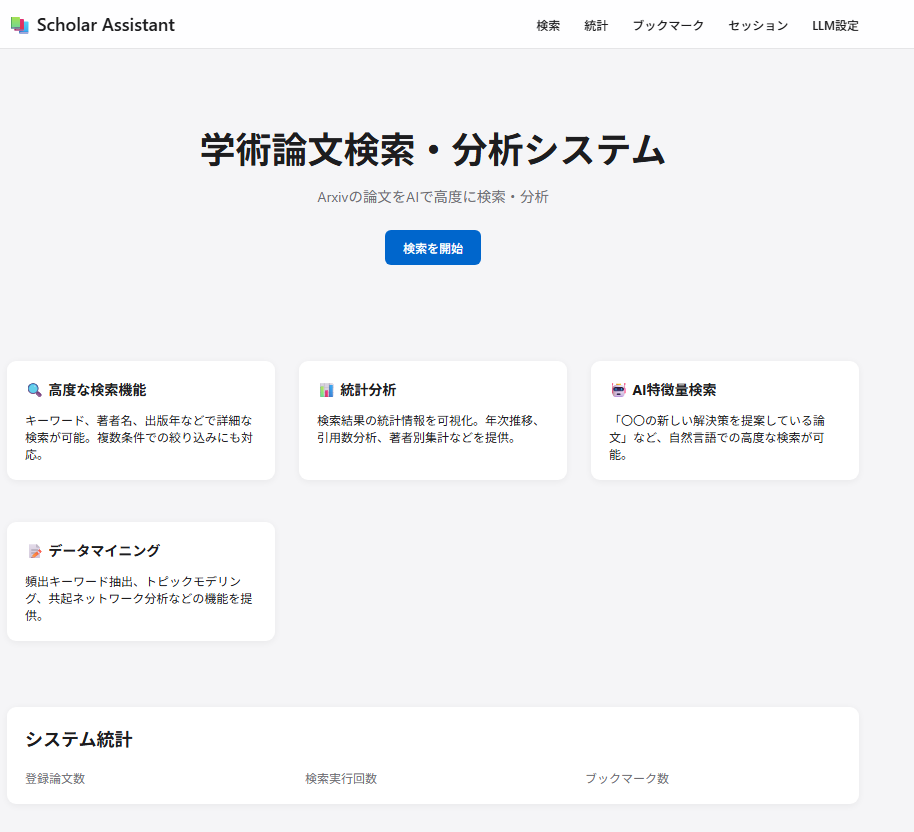
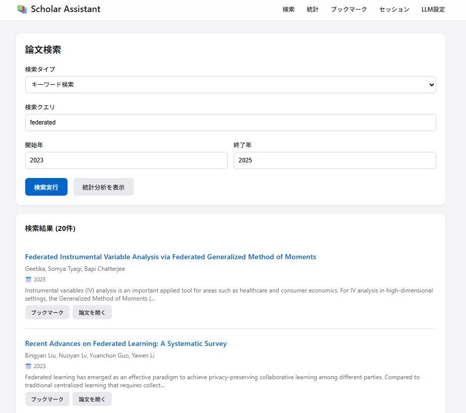

# モノリス論文検索・分析アプリケーション

研究者や学生向けの学術論文検索・分析システムです。Google Scholarから論文情報を取得し、AIを活用した高度な検索・分析機能を提供します。

## project




## 主な機能

### 1. 論文検索機能
- **基本検索**: キーワード、著者名、論文タイトルでの検索
- **絞り込み検索**: 出版年範囲での絞り込み
- **複数クエリ検索**: AND/OR条件での複雑な検索

### 2. 結果表示・分析
- **検索結果一覧**: 引用数や発行年でのソート機能
- **論文詳細表示**: アブストラクトの確認

### 3. データマイニング
- **サマリーマイニング**: 頻出キーワード抽出、共起分析
- **トピックモデリング**: LDAによるトピック分析
- **共起ネットワーク**: キーワード間の関係性可視化

### 4. AI機能
- **LLM特徴量検索**: 自然言語での高度な検索
- **類似論文検索**: ベクトル埋め込みによる類似性検索
- **新規性説明**:　概要から手法、新規性を要約する

## 技術スタック

- **バックエンド**: Python 3.10+, Flask
- **フロントエンド**: Vue.js 3, Chart.js
- **データベース**: PostgreSQL
- **論文データ取得**: arxiv ( [Arxiv API](https://info.arxiv.org/about/index.html))
- **データ分析**: pandas, scikit-learn, NLTK
- **AI/LLM**: OpenAI API (GPT-4), LangChain, Faiss, 
- **インフラ**: Docker, Gunicorn, Nginx

## セットアップ

### 1. 前提条件
- Docker & Docker Compose
- OpenAI API キー

### 2. 環境構築

```bash
# リポジトリのクローン
git clone <repository-url>
cd scholar-app

# 環境変数の設定
cp .env.example .env
# .envファイルを編集し、必要な値を設定

# Dockerコンテナの起動
docker-compose up -d

# データベースのマイグレーション
docker-compose exec web flask db init
docker-compose exec web flask db migrate
docker-compose exec web flask db upgrade
```

### 3. アクセス
ブラウザで `http://localhost` にアクセス

## 開発

### ローカル開発環境

```bash
# 仮想環境の作成
python -m venv venv
source venv/bin/activate  # Windows: venv\Scripts\activate

# 依存関係のインストール
pip install -r requirements.txt

# データベースのセットアップ
flask db init
flask db migrate
flask db upgrade

# 開発サーバーの起動
python run.py
```

### プロジェクト構造

```
/scholar-app
├── .gitignore                 # Git除外設定
├── .env.example              # 環境変数テンプレート
├── .env                      # 環境変数（Git管理外）
├── README.md                 # プロジェクト説明
├── requirements.txt          # Python依存関係
├── config.py                # アプリケーション設定
├── run.py                   # 起動スクリプト
├── docker_compose.yml       # Docker Compose設定
├── dockerfile.yml           # Dockerイメージ定義
├── nginx.conf              # Nginx設定
│
├── app/                     # アプリケーションコード
│   ├── __init__.py         # Flask初期化
│   ├── models.py           # データベースモデル (Paper, SearchSession, Bookmark)
│   ├── tasks.py            # Celeryバックグラウンドタスク
│   │
│   ├── main/               # メインブループリント
│   │   ├── __init__.py
│   │   ├── routes.py       # メインルーティング
│   │   └── llm_routes.py   # LLM関連APIエンドポイント
│   │
│   ├── auth/               # 認証機能（オプション）
│   │   └── models.py       # ユーザーモデル
│   │
│   ├── services/           # ビジネスロジック
│   │   ├── scholar_service.py      # Google Scholar連携
│   │   ├── analysis_service.py     # データ分析・マイニング
│   │   ├── llm_service.py          # LLM機能（従来版）
│   │   ├── unified_llm_service.py  # 統合LLMサービス
│   │   ├── local_model_manager.py  # ローカルモデル管理
│   │   ├── model_manager.py        # モデルマネージャー（重複）
│   │   ├── gpu_detector.py         # GPU環境検出
│   │   └── export_service.py       # エクスポート機能
│   │
│   ├── static/             # 静的ファイル
│   │   ├── css/
│   │   │   └── style.css   # アプリケーションスタイル
│   │   └── js/
│   │       └── llm_config.js  # LLM設定JavaScript
│   │
│   └── templates/          # HTMLテンプレート
│       ├── base.html       # ベーステンプレート
│       ├── index.html      # トップページ
│       ├── search.html     # 検索ページ
│       └── llm_config.html # LLM設定ページ
│
├── migrations/             # DBマイグレーション（Git管理外）
│
└── tests/                  # テストコード
    └── test_services.py    # サービスレイヤーテスト
```
## API エンドポイント

### 検索関連
- `POST /api/search` - 論文検索
- `GET /api/paper/<id>` - 論文詳細取得

### 分析関連
- `POST /api/statistics` - 統計情報取得
- `POST /api/mining` - データマイニング実行

### AI/LLM機能
- `POST /api/llm/search` - AI検索
- `POST /api/llm/answer` - 質問応答
- `GET /api/llm/gpu-info` - GPU環境情報取得
- `GET /api/llm/backends` - 利用可能なLLMバックエンド取得
- `GET /api/llm/models/compatible` - 互換性のあるモデル一覧
- `POST /api/llm/backend/configure` - LLMバックエンド設定
- `GET /api/llm/backend/status` - 現在のバックエンド状態
- `POST /api/llm/models/download` - モデルダウンロード
- `DELETE /api/llm/models/cache` - モデルキャッシュクリア
- `POST /api/llm/generate` - テキスト生成

### ユーザー機能
- `POST /api/bookmark` - ブックマーク追加
- `GET /api/bookmarks` - ブックマーク一覧
- `GET /api/sessions` - 検索セッション一覧

### エクスポート機能
- `POST /api/export/csv` - CSV形式でエクスポート
- `POST /api/export/excel` - Excel形式でエクスポート
- `POST /api/export/bibtex` - BibTeX形式でエクスポート
- `POST /api/export/json` - JSON形式でエクスポート
- `POST /api/export/pdf` - PDF形式でエクスポート
## 注意事項

### Google Scholar利用規約の遵守
- リクエスト間に最低2秒のウェイトを設定
- 過度なアクセスを避けるためのキャッシュ機構を実装
- 商用利用の場合は別途確認が必要

### パフォーマンス考慮事項
- 大量の論文処理時はバッチ処理を推奨
- LLM処理は処理時間がかかるため、非同期処理の検討を推奨

## ライセンス

本プロジェクトは研究・教育目的での利用を想定しています。商用利用の際は別途ご相談ください。

## 貢献

バグ報告や機能改善の提案は、GitHubのIssuesまでお願いします。

## サポート

質問や問題がある場合は、プロジェクトのIssuesセクションで報告してください。